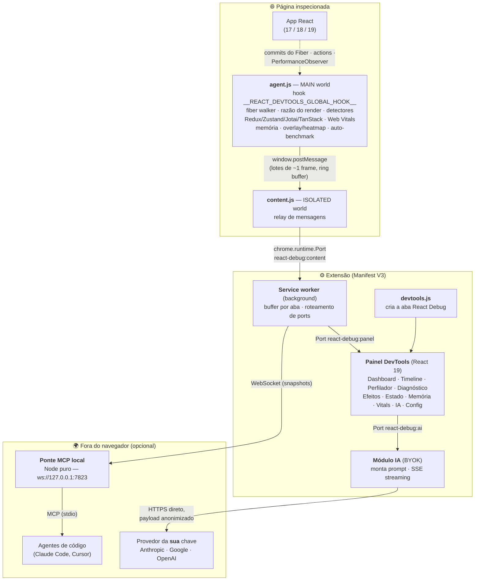
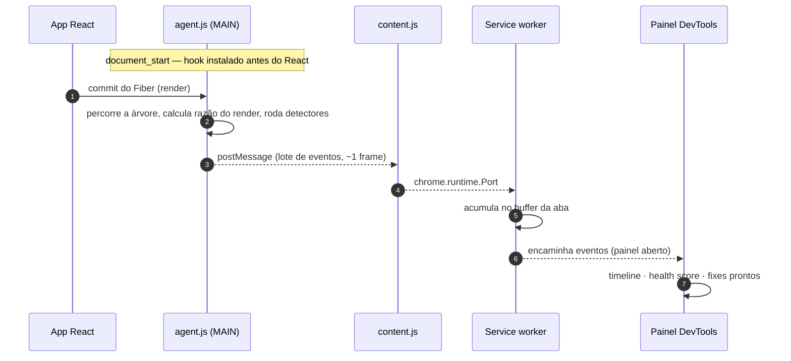

# ⚛️ React Debug

> Extensão Chrome (DevTools) de depuração e otimização de performance para aplicações React.
> Posicionamento: **"te digo o que está errado e como consertar"** — unifica React DevTools,
> aba Performance, Redux DevTools, React-Scan e why-did-you-render em uma única aba,
> com **zero alterações de código no app**.

React Debug adiciona uma aba ao DevTools que mostra cada render (e a **razão** dele),
audita seus `useEffect`, acompanha estado Redux/Zustand/Jotai/TanStack Query, mede
memória e Web Vitals **com atribuição por componente React** — e, para cada problema
detectado, entrega explicação em português e um **fix pronto para copiar**.

---

## Painéis

| Painel | O que faz | Funciona em produção? |
|---|---|---|
| **Painel (Dashboard)** | Health Score 0–100, KPIs de gravidade, sparkline de pressão de render, top infratores com fix, alertas de perf budget, modo antes/depois | Parcial |
| **Linha do tempo** | Todo evento em ordem: renders, actions, efeitos, shifts, erros — com correlação causal ("action `cart/add` → 12 renders") | Parcial (erros/vitals sim) |
| **Perfilador** | Contagem e razão de cada render (props/estado/pai), detector de render desnecessário (props inline), perf budgets por componente, jump-to-source | Não (precisa build dev) |
| **Diagnóstico** | `key={index}`, cascata de contexto, cascata de Suspense, hydration mismatch (Next.js), custo de handler inline | Não |
| **Efeitos** | Auditor de `useEffect`: cleanup faltando, sem array de deps, deps instáveis, efeito em loop, fetch sem AbortController | Não |
| **Estado** | Árvore Redux ao vivo, histórico de actions, dispatch manual — sem instalar nada no app. Leitura básica de Zustand/Jotai/TanStack Query | Sim (se o app expõe o hook) |
| **Memória** | Heap ao longo do tempo, taxa de crescimento, alerta honesto de "crescimento suspeito" | Sim |
| **Web Vitals** | CLS/LCP/INP/FCP/TTFB em tempo real, com **atribuição por componente React** ("o shift veio do `<ProductCard>`") | Sim (atribuição só em dev) |
| **Análise de IA** | Análise de desempenho, risco de falha e segurança com a **sua** chave (BYOK: Anthropic/Google/OpenAI), streaming, export `.patch` | — |
| **Configurações** | Chaves BYOK (`chrome.storage.local`), teste de chave, seleção de modelo, telemetria opt-in (desligada por padrão) | — |

### Extras

- 🔥 **Overlay + heatmap na página** — bordas nos componentes que renderizam; heatmap com
  cor por frequência e **scrubber temporal** (revisite os últimos 60s arrastando).
- 🤖 **Ponte MCP local** — agentes de código (Claude Code, Cursor) leem os diagnósticos de
  runtime via MCP e corrigem o código com dados reais. Veja [`bridge/MCP.md`](bridge/MCP.md).
- ⬇ **Snapshot exportável** — JSON com timeline + achados para anexar em ticket.
- 📏 **Auto-benchmark** — o overhead da própria extensão (ms/frame) fica visível no rodapé.

---

## Requisitos

- **Chrome/Brave/Edge 111+** (Manifest V3).
- **Node.js 18+** para build.
- Para dados completos (renders, efeitos, razões): app rodando em **build de
  desenvolvimento** do React **17, 18 ou 19**. Em build de produção, os recursos de
  browser (Web Vitals, memória, erros) continuam funcionando e o painel avisa o que
  está indisponível.

## Instalação (desenvolvimento)

```bash
npm install        # dependências (esbuild, TypeScript, React p/ UI do painel)
npm run build      # gera dist/
```

Depois, no navegador:

1. Abra `chrome://extensions`
2. Ative o **Modo do desenvolvedor**
3. **Carregar sem compactação** → selecione a pasta `dist/`
4. Abra qualquer página → F12 → aba **React Debug**

### Scripts

| Comando | O que faz |
|---|---|
| `npm run build` | Build completo em `dist/` |
| `npm run watch` | Build incremental (edite e recarregue a extensão) |
| `npm run demo` | Servidor da demo em `http://localhost:8123` |
| `npm run bridge` | Ponte MCP local para agentes de código (`ws://127.0.0.1:7823`) |
| `npm run typecheck` | Checagem de tipos (sem emitir) |
| `node scripts/make-icons.mjs` | Regenera os ícones PNG da extensão (sem dependências) |

## Demo com bugs plantados

A melhor forma de conhecer a ferramenta:

- **Demo embutida** — clique em "▶ testar na demo embutida" no rodapé do painel
  (aparece quando não há React na página), ou abra `chrome-extension://<id>/demo/index.html`.
- **Demo local** — `npm run demo` → `http://localhost:8123` (React 19, bundle local).
- **Matrix de versões** — `http://localhost:8123/matrix.html?v=17` ou `?v=18` valida o
  adapter contra React 17/18 (UMD dev via CDN, requer internet).

A demo planta de propósito: props inline (renders desnecessários), `setInterval` sem
cleanup, efeito sem deps, dependência instável, fetch sem abort, `key={index}`,
cascata de contexto, cascata de Suspense, hydration mismatch, layout shift (CLS),
handler bloqueante (INP) e um mini-Redux com carrinho.

## Arquitetura

Visão completa da extensão — todos os componentes e por onde os dados trafegam:



### Como funciona, passo a passo

1. **Injeção antecipada** — o `agent.js` entra em `document_start` no MAIN world e instala o
   `__REACT_DEVTOOLS_GLOBAL_HOOK__` **antes** do React carregar (se o React DevTools oficial
   já estiver lá, pega carona no hook dele sem quebrá-lo).
2. **Captura** — a cada commit do React, o agent percorre a árvore Fiber, calcula a **razão de
   cada render** (props? estado? pai?), roda os detectores (key={index}, efeito sem cleanup,
   props inline…) e coleta Redux, Web Vitals e memória.
3. **Transporte** — os eventos são lotados (~1 frame) num ring buffer e seguem por
   `window.postMessage` → `content.js` → `Port` → service worker, que mantém um buffer por aba.
4. **Exibição** — com o DevTools aberto, o painel recebe o fluxo pelo seu `Port`, correlaciona
   causa e efeito ("action `cart/add` → 12 renders") e desenha timeline, score e gráficos.
5. **Opcionais** — a análise de IA envia um snapshot **anonimizado** direto ao provedor da sua
   chave; a ponte MCP entrega os mesmos diagnósticos a agentes de código na sua máquina.



Notas técnicas:

- Fiber é API não-oficial: a leitura é 100% defensiva e versionada (`react-adapter/`).
- Redux é capturado emulando o hook do Redux DevTools (`__REDUX_DEVTOOLS_EXTENSION__`);
  Zustand/Jotai entram pelo `connect()` do mesmo hook; TanStack Query via
  `window.__TANSTACK_QUERY_CLIENT__`.

### Estrutura de pastas

```
├── public/            # manifest.json, HTMLs, CSS, ícones, demo embutida
├── src/
│   ├── agent/         # MAIN world: react-adapter, detectores, vitals, redux, memória, overlay
│   ├── content/       # relay ISOLATED world
│   ├── background/    # service worker: roteamento por aba, IA (BYOK), ponte MCP
│   ├── devtools/      # cria a aba no DevTools
│   ├── panel/         # UI React do painel (tabs, componentes, IA, budgets, baseline)
│   └── shared/        # protocolo de mensagens tipado + settings
├── demo/              # demo local com bugs plantados + matrix React 17/18
├── bridge/            # ponte MCP local (Node puro) + docs de configuração
├── scripts/           # geração de ícones
└── store/             # textos da Chrome Web Store + política de privacidade
```

## Análise de IA (BYOK) e privacidade

- Nenhum dado sai da máquina, **exceto** quando você pede uma análise de IA — e aí um
  snapshot resumido vai **direto do service worker para o provedor da sua chave**
  (Anthropic, Google ou OpenAI). Sem servidor intermediário.
- Antes do envio: anonimização automática (e-mails, tokens, CPFs → placeholders) e
  **preview do payload exato** na tela.
- Chaves ficam em `chrome.storage.local` (nunca `storage.sync`, nunca hardcoded).
- Telemetria desligada por padrão. Política completa em
  [`store/politica-de-privacidade.md`](store/politica-de-privacidade.md).

## Documentos do projeto

- [`SPEC.md`](SPEC.md) — especificação do produto e arquitetura
- [`PLANNING.md`](PLANNING.md) — planejamento por etapas com estado real de cada item
- [`bridge/MCP.md`](bridge/MCP.md) — como conectar Claude Code/Cursor à ponte MCP
- [`store/descricao-web-store.md`](store/descricao-web-store.md) — material e passo a passo de publicação

## Status

MVP + v1.1 + v1.2 implementados (Etapas 0–9 do `PLANNING.md`). Pendências para o
lançamento: verificação manual final na demo e publicação na Chrome Web Store.
Fora do escopo atual (v2.0): modo CI headless (`react-debug-ci` via Playwright).

## Licença

Projeto privado — todos os direitos reservados (licença a definir antes da publicação).
